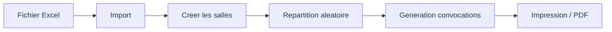

<div align="center">


# GLS — Gestion d'Examens & Convocations

**Application web legere, sans backend, pour orchestrer un examen de A a Z.**
*Importez vos etudiants, creez vos salles, repartissez aleatoirement, generez les convocations imprimables.*

<p>
  
  
  
  
</p>

<p>
  
  
  
  
</p>

<sub>Crafted by <a href="#"><b>CodeSommet</b></a> — web solutions that reach the summit.</sub>

</div>

---

## Fonctionnalites

| | |
|---|---|
| **Import Excel** | Lecture directe des fichiers `.xlsx` / `.xls` (auto-detection des colonnes `Ref`, `Etudiant`, `Telephone`, `Groupe`). |
| **Gestion des salles** | Ajout, modification, suppression — chaque salle a sa capacite maximale. |
| **Repartition aleatoire** | Algorithme **Fisher-Yates**, remplissage sequentiel jusqu''a capacite. |
| **Convocations PDF-ready** | Une page **A4** par etudiant, prete a imprimer ou exporter en PDF. |
| **Persistance locale** | Tout est sauvegarde en `localStorage` — pas de serveur, pas de compte. |
| **Statistiques live** | Total etudiants, places disponibles, etat de remplissage par salle. |

---

## Demarrage rapide

```bash
# 1. Cloner le repo
git clone https://github.com/codesommet/gls-convocation-html.git
cd gls-convocation-html

# 2. Ouvrir dans le navigateur
start enrollments.html     # Windows
open  enrollments.html     # macOS
xdg-open enrollments.html  # Linux
```

> **Aucune installation requise.** Aucune dependance a installer. Tout tourne dans votre navigateur.

---

## Structure

```
gls-convocation/
├── enrollments.html   # Application complete (HTML + CSS + JS)
├── gls-noir.png       # Logo officiel GLS (en-tete des convocations)
└── README.md
```

---

## Workflow



1. **Renseignez** les infos de l''examen (centre, niveau, date, heure).
2. **Importez** votre fichier Excel contenant la liste des etudiants.
3. **Definissez** vos salles et leurs capacites.
4. **Lancez** la repartition aleatoire.
5. **Generez** les convocations et imprimez.

---

## Format Excel attendu

Le fichier doit contenir au minimum les colonnes suivantes (l''ordre n''a pas d''importance, l''application les detecte automatiquement) :

| Ref | Etudiant | Telephone | Groupe |
|-----|----------|-----------|--------|
| 2025001 | Benani Mohamed | 0600000000 | G1 |
| 2025002 | ... | ... | ... |

---

## Confidentialite

- **Zero reseau.** Aucune donnee ne quitte votre navigateur.
- **Zero tracking.** Pas d''analytics, pas de cookies tiers.
- **Stockage local** uniquement (`localStorage` du navigateur).

---

## Stack technique

- **HTML5 / CSS3 / Vanilla JS** — aucun framework
- **[SheetJS](https://sheetjs.com/)** (CDN) pour le parsing Excel
- **localStorage** pour la persistance
- **CSS print media** pour les convocations A4

---

<div align="center">

### Made with care by **CodeSommet**

<sub>© 2026 CodeSommet — Tous droits reserves.</sub>

</div>